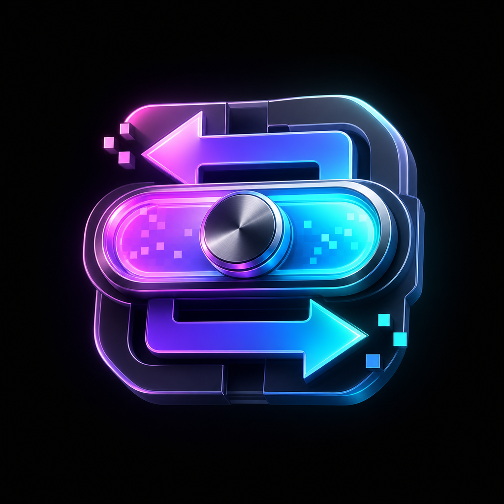
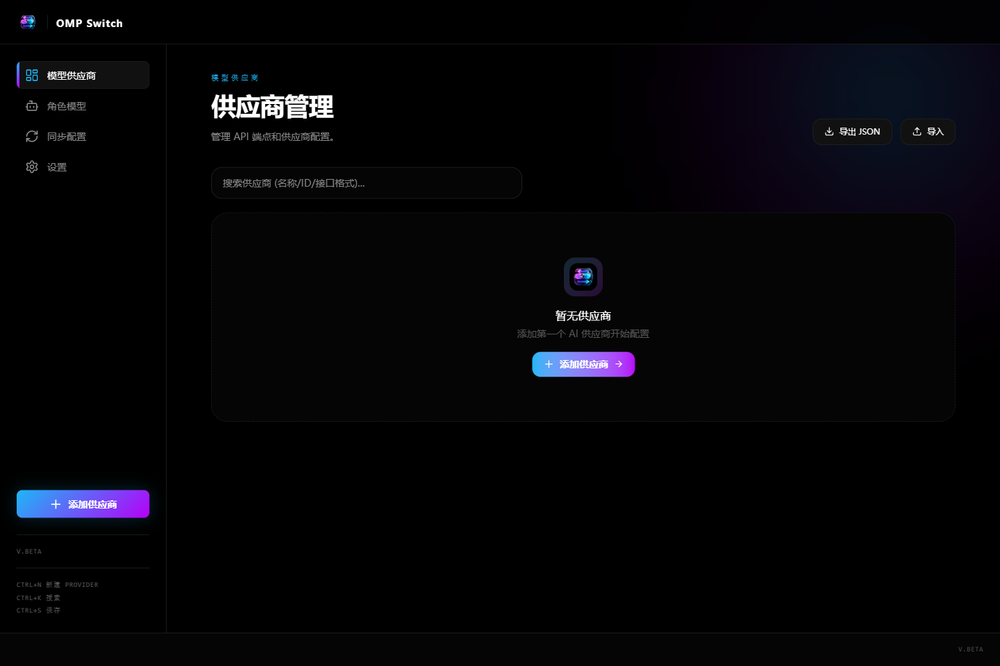
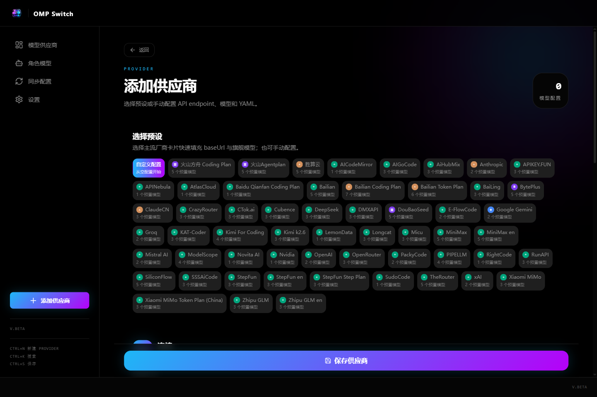
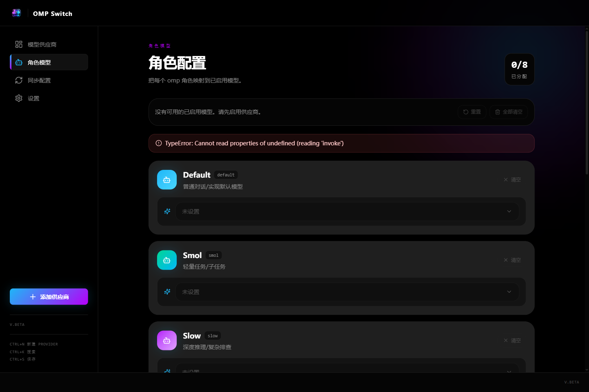
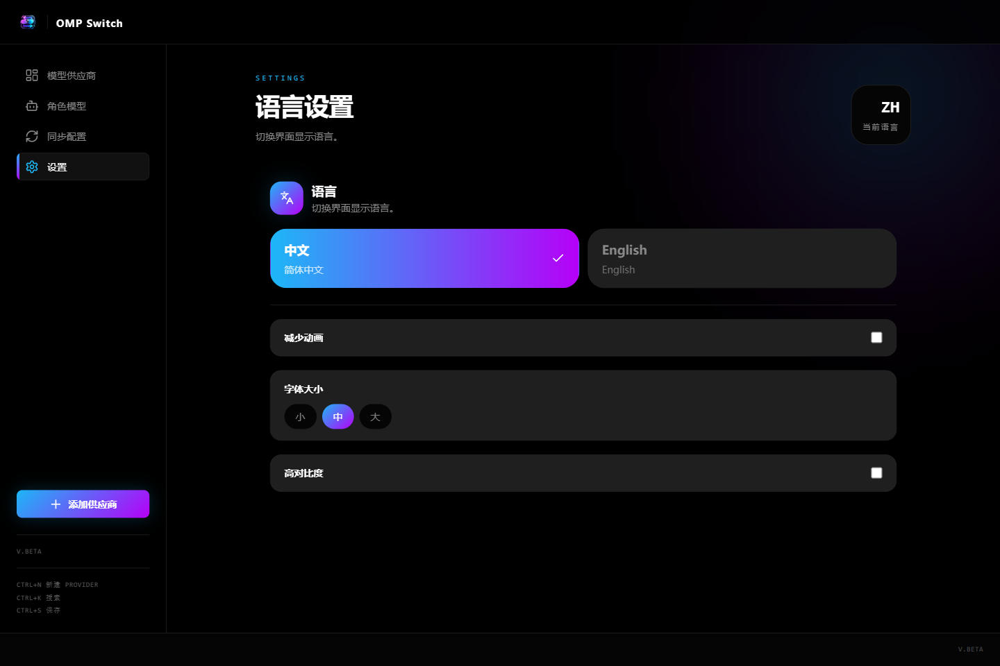

<p align="center">
  
</p>

<h1 align="center">OMP Switch</h1>

<p align="center">
  <strong>A desktop configuration manager for oh-my-pi / omp AI providers.</strong>
</p>

<p align="center">
  <a href="README.md">English</a> · <a href="README.zh.md">中文</a>
</p>

<p align="center">
  <strong>Version</strong>: V1.0.2 · <strong>Platforms</strong>: Windows / macOS / Linux
</p>

## What is it?

OMP Switch is a desktop app for managing `omp` / `oh-my-pi` provider and model configuration without editing YAML by hand.

It helps you add providers, choose preset model configs, manage model roles, sync settings across devices, and automatically write the files used by `omp`.

## Download and install

Download the latest installer from [GitHub Releases](../../releases).

- **Windows**: download the `.msi` installer.
- **macOS**: download the `.dmg` package.
- **Linux**: download the `.AppImage` package.

No Node.js, Rust, or Tauri dependencies are required for normal use. They are only needed for development.

## Screenshots









## Main features

- **Provider management**: add, edit, delete, enable, duplicate, and test AI providers.
- **Provider presets**: quickly start from common providers such as OpenAI, Anthropic, DeepSeek, Kimi, StepFun, Qwen, MiniMax, SiliconFlow, and more.
- **Model configuration**: edit model ID, API type, reasoning support, input types, costs, context window, max tokens, custom headers, and compatibility options.
- **Model roles**: assign default models for `default`, `smol`, `slow`, `plan`, and `commit` roles.
- **Automatic file sync**: keeps SQLite as the source of truth and writes `models.yml` / `settings.json` for `omp`.
- **WebDAV sync**: sync configuration between devices via services such as Jianguoyun or Nextcloud.
- **API key encryption**: stores sensitive keys with AES-256-GCM encryption.
- **Offline first**: local configuration stays available even when WebDAV sync fails.

## Where are configs written?

OMP Switch manages local app data and exports provider/model files for `omp`, including:

- `~/.omp/agent/models.yml`
- `~/.omp/agent/settings.json`

You can still inspect or edit generated files manually when needed.

## Development

Development requires:

- Node.js 20+
- Rust 1.77.2
- Tauri 2 system prerequisites: <https://v2.tauri.app/start/prerequisites/>

```bash
git clone https://github.com/Wenlong-Guo/omp-switch.git
cd omp-switch
npm install
npm run tauri dev
```

## Build

```bash
npm run tauri build
```

## Tests

```bash
npm run test
npm run test:pipeline
npm run test:e2e
```

## Architecture

```text
omp-switch/
├── src/                       # React frontend (Vite)
├── src-tauri/                 # Rust backend (Tauri 2)
├── e2e-playwright-test/       # Playwright E2E tests
├── docs/                      # Project docs and screenshots
└── scripts/                   # Build and release scripts
```

## License

MIT
